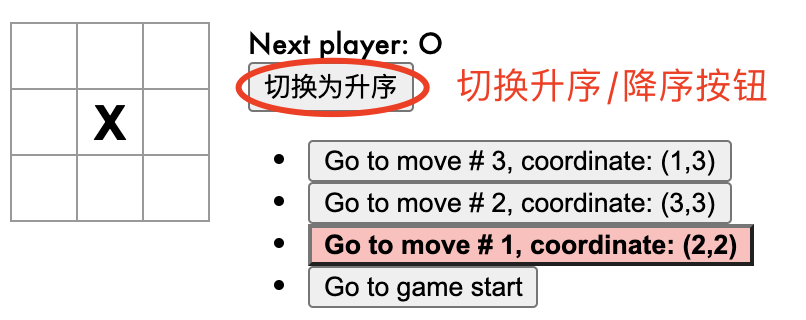

# tic-tac-toe(三连棋)游戏-改进
首先按照 
[React-官方教程](https://zh-hans.reactjs.org/tutorial/tutorial.html)
，完成
[tic-tac-toe(三连棋)基本功能](https://codepen.io/gaearon/pen/gWWZgR?editors=0010)。

## 改进游戏
1. 在游戏历史记录列表显示每一步棋的坐标，格式为 (列号, 行号)。
2. 在历史记录列表中加粗显示当前选择的项目。
3. 使用两个循环来渲染出棋盘的格子，而不是在代码里写死（hardcode）。
4. 添加一个可以升序或降序显示历史记录的按钮。
5. 每当有人获胜时，高亮显示连成一线的 3 颗棋子。
6. 当无人获胜时，显示一个平局的消息。

## 改进3. 使用两个循环渲染棋盘格子
第 1 条和第 3 条改进要求可合并考虑。

由于 *squares* 是含有 9 个元素的数组，Square 组件需要根据索引获取每一项的值，因此循环渲染棋盘格子时，保证每个格子的值与索引一一对应是个很好的办法。  
此处采用遍历 *行数组* 时嵌套遍历 *列数组* 的渲染方式。

### 注意：设置 key
> 当我们需要渲染一个列表的时候，React 会存储这个列表每一项的相关信息。当我们要更新这个列表时，React 需要确定哪些项发生了改变。我们有可能增加、删除、重新排序或者更新列表项。


### 具体代码如下：
```js
class Board extends React.Component {
  render () {
    return (
      // 数组 [0, 3, 6] 表示每行第一列的值，
      // 用数组中每个元素的 index 表示行坐标 x
      [0, 3, 6].map((row, x) => {
        return (
          <div className="board-row" key={row}>
            {
              // 数组 [0, 1, 2] 表示列坐标，
              // 用数组中每个元素的 index 表示列坐标 y
              [0, 1, 2].map((col, y) => {
                // coord 为每个棋盘格子的坐标
                const coord = { x, y };
                // id 为每个棋盘格子的值
                const id = row + col;
                return (
                  <Square value={this.props.squares[id]}
                    onClick={() => this.props.onClick(id, coord)}
                    key={col}
                  />
                )
              })
            }
          </div>
        )
      })
    );
  }
}
```


## 改进1. 在游戏历史记录列表显示每一步棋的坐标，格式为 (列号, 行号)。

### 1. 将 Board 组件内的 coord 数据传递给 Game 组件
```js
return (
      <div className="game">
        <div className="game-board">
          <Board squares={current.squares}
            winnerId={winner.result}
            onClick={(i, coord) => { this.handleClick(i, coord) }}
          />
        </div>
        <div className="game-info">
          <div>{status}</div>
          <ul>{moves}</ul>
        </div>
      </div>
    );
```
### 2. Game 组件的 history state 增加 coord 变量

```js
class Game extends React.Component {
  constructor(props) {
    super(props);
    this.state = {
      history: [
        {
          squares: Array(9).fill(null),
          coord: { x: null, y: null }
        }
      ],
      stepNumber: 0,
      xIsNext: true
    }
  }
}
```
### 3. 修改 Game 组件的 handleClick 方法，点击棋盘落子时同步更新 coord
```js
handleClick (i, coord) {
    const history = this.state.history.slice(0, this.state.stepNumber + 1);
    const current = history[history.length - 1];
    const squares = current.squares.slice();
    if (calculateWinner(squares).result || squares[i]) {
      return;
    }
    squares[i] = this.state.xIsNext ? 'X' : 'O';
    this.setState({
      history: history.concat([{
        squares: squares,
        // 子组件 Board 通过此函数传入 coord 
        coord: coord
      }]),
      stepNumber: history.length,
      xIsNext: !this.state.xIsNext
    })
  }
```
### 4. 修改 moves 变量，增加显示每一步点击的坐标
> 当我们遍历 history 数组时，step 变量指向的是当前 history 元素的值，而 move 则指向的是 history 元素的索引。
```js
render(
    const moves = history.map((step, move) => {
      const stepNumber = this.state.stepNumber;
      const coord = step.coord;
      const desc = move ? `Go to move # ${move}, coordinate: (${coord.y + 1},${coord.x + 1})` : 'Go to game start';
      return (
        <li key={move}>
          <button onClick={() => this.jumpTo(move)}>{desc}</button>
        </li>
      )
    })
  )
```
## 改进2. 在历史记录列表中加粗显示当前选择的项目


要求回退历史记录时，加粗显示回退到的步骤。

因此需要定义一个表示高亮 button 的类的变量 highlightCls ，并在 jumpTo() 方法中同步切换 highlightCls 的值，然后在继续下棋时恢复 highlightCls 的默认值。
### 1. 定义 highlightCls 变量
```js
constructor(props) {
    super(props);
    this.state = {
      history: [
        {
          squares: Array(9).fill(null),
          coord: { x: null, y: null }
        }
      ],
      stepNumber: 0,
      xIsNext: true,
      highlightCls: ''
    }
  }
```
### 2. 修改 jumpTo() 函数
点击跳转历史记录时，修改 highlightCls 的值为 "highlightCls"
```js
jumpTo (step) {
    this.setState({
      stepNumber: step,
      xIsNext: (step % 2) === 0,
      // 修改 highlightCls 的值
      highlightCls: "highlightCls"
    })
  }
```
### 3. 给 button 添加条件 className
*注意：添加 highlightCls 的判断条件*
```js
const moves = history.map((step, move) => {
      const stepNumber = this.state.stepNumber;
      const highlightCls = this.state.highlightCls;
      const coord = step.coord;
      const desc = move ? `Go to move # ${move}, coordinate: (${coord.y + 1},${coord.x + 1})` : 'Go to game start';
      return (
        <li key={move}>
          <button className={move === stepNumber ? highlightCls : ''} onClick={() => this.jumpTo(move)}>{desc}</button>
        </li>
      )
    })
```
### 4. 修改 handleClick() 函数
onClick 时恢复历史记录 button 的样式
```js
handleClick (i, coord) {
    const history = this.state.history.slice(0, this.state.stepNumber + 1);
    const current = history[history.length - 1];
    const squares = current.squares.slice();
    if (calculateWinner(squares).result || squares[i]) {
      return;
    }
    squares[i] = this.state.xIsNext ? 'X' : 'O';
    this.setState({
      history: history.concat([{
        squares: squares,
        coord: coord
      }]),
      stepNumber: history.length,
      xIsNext: !this.state.xIsNext,
      // 继续下棋时，button 恢复默认样式
      highlightCls: ''
    })
  }
```
### 5. 定义 highlightCls 的 css 样式
```css
.game-info .highlightCls{
  font-weight: bold;
  background-color: rgba(255, 0, 0, 0.3);
}
```
## 改进4. 添加一个可以升序或降序显示历史记录的按钮

### 1. 添加切换升序/降序的按钮
```js
<div className="game-info">
    <div>{status}</div>
    <button onClick={() => this.handleSwitch()}>切换顺序</button>
    <ul>{moves}</ul>
</div>
```
### 2. state 中添加 isAscOrder 变量
默认为 true
```js
constructor(props) {
    super(props);
    this.state = {
      history: [
        {
          squares: Array(9).fill(null),
          coord: { x: null, y: null }
        }
      ],
      stepNumber: 0,
      xIsNext: true,
      highlightCls: '',
      isAscOrder: true
    }
  }
```
### 3. 定义 handleSwitch() 函数
实现点击按钮时切换 isAscOrder 变量的值
```js
handleSwitch () {
    this.setState({
      isAscOrder: !this.state.isAscOrder
    })
  }
```
### 4. 根据 isAscOrder 值修改 moves 数组
如果 isAscOrder 为 false，即降序排列，则反转 moves
```js
if (!isAscOrder) {
  moves.reverse()
}
```
## 改进5. 每当有人获胜时，高亮显示连成一线的 3 颗棋子

- 要修改获胜时连成一线的棋子，则须修改判断获胜函数的返回值，以获取 3 颗棋子对应的位置 winnerId ；
- 然后通过 props 将 winnerId 传递给子组件 Board , Board 组件内新建变量 winnerBg 来控制 winnerId 对应格子的样式；
- 最后通过 props 将变量 winnerBg 的值传递给子组件 Square
### 1. 修改 calculateWinner 函数的返回值
*注意：同步修改组件中使用到此函数返回值的逻辑*
```js
function calculateWinner (squares) {
  const lines = [
    [0, 1, 2],
    [3, 4, 5],
    [6, 7, 8],
    [0, 3, 6],
    [1, 4, 7],
    [2, 5, 8],
    [0, 4, 8],
    [2, 4, 6],
  ];
  for (let i = 0; i < lines.length; i++) {
    const [a, b, c] = lines[i];
    if (squares[a] && squares[a] === squares[b] && squares[a] === squares[c]) {
      return { result: [a, b, c], who: squares[a] };
      // return squares[a];
    }
  }
  return { result: null };
}
```
### 2. 获取 winnerId, 并通过 props 传递给 Board 组件
```js
render () {
    const history = this.state.history;
    const stepNumber = this.state.stepNumber;
    const current = history[stepNumber];
    const winner = calculateWinner(current.squares);
    return (
      <div className="game">
        <div className="game-board">
          <Board squares={current.squares}
            winnerId={winner.result}
            onClick={(i, coord) => { this.handleClick(i, coord) }}
          />
        </div>
      </div>
    );
}
```
### 3. 新建变量 winnerBg ，并通过 winnerId 控制其值
*注意：winnerId 是出现获胜者之后才有的，因此修改 winnerBg 的判断条件是 (winnerId && winnerId.includes(id))*
```js
class Board extends React.Component {
  render () {
    return (
      [0, 3, 6].map((row, x) => {
        return (
          <div className="board-row" key={row}>
            {
              [0, 1, 2].map((col, y) => {
                const coord = { x, y };
                const id = row + col;
                // 获取 winnerId, 并控制 winnerBg 的值
                const winnerId = this.props.winnerId;
                let winnerBg = '';
                if (winnerId && winnerId.includes(id)) {
                  winnerBg = "winnerBg"
                }
                // 通过 props 将 winnerBg 传递给 Square 组件
                return (
                  <Square value={this.props.squares[id]}
                    winnerCls={winnerBg}
                    onClick={() => this.props.onClick(id, coord)}
                    key={col}
                  />
                )
              })
            }
          </div>
        )
      })
      // .reverse()
    );
  }
}
```
### 4. 修改 Square 组件逻辑，在 className 中添加 winnerCls 
```js
function Square (props) {
  return (
    <button className={"square " + props.winnerCls} onClick={props.onClick}>
      {props.value}
    </button>
  )
}
```
### 5. 定义 winnerBg 样式
```css
.winnerBg {
  background-color: rgba(0, 255, 0, 0.5);
}
```
## 改进6: 当无人获胜时，显示一个平局的消息
平局：即所有格子都已填满，但无人获胜的情况。


直接修改 status 变量的判断逻辑即可。
```js
let status;
if (winner.result) {
  status = 'Winner: ' + winner.who;
} else if (!winner.result && stepNumber === 9) {
  status = "平局!"
} else {
  status = 'Next player: ' + (this.state.xIsNext ? 'X' : 'O');
}
```